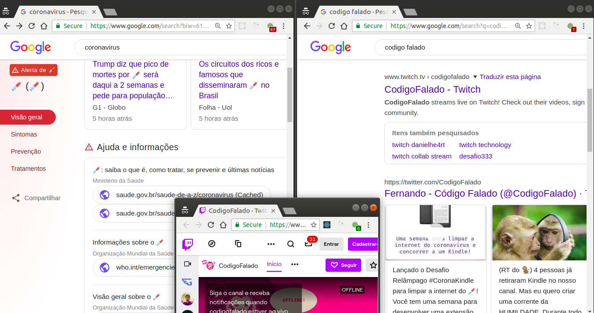

# corongue-se

> Minha extensão para o navegador [Google Chrome](https://www.google.com/intl/pt-BR/chrome) para participar do [sorteio do @codigofalado](https://twitter.com/codigofalado/status/1244296923424702465)

## Features

- O ícone da extensão informa a quantidade de seringas utilizadas para salvar a página
- É possível ativar/desativar clicando no ícone da extensão (otimizado thanks to [_CSS variables_](https://caniuse.com/#search=css%20variables))
- Funciona no https://google.com ignorando os _breadcrumbs_ que indicam a URL das páginas indexadas
- Funciona no https://duckduckgo.com ignorando o texto da URI das páginas indexadas
- Funciona em SPAs (ao menos na página dedicada ao _coronavirus_ na busca do Google)
- Não substitui em partes de URL
- Não usa recursão e nem carrega todos os elementos da página de um só vez (thanks to [`document.createNodeIterator()`](https://caniuse.com/#search=createnodeiterator))

### Testes

Páginas para testar:

- https://www.google.com/search?q=coronavirus
- https://duckduckgo.com/?q=coronavírus
- http://www.tjsp.jus.br/Coronavirus
- https://webcache.googleusercontent.com/search?q=cache:uiRKlsc7mDsJ:https://www.saude.gov.br/saude-de-a-z/coronavirus
- https://www.twitch.tv/codigofalado

## Como usar?

1. Vá para a aba [releases](https://github.com/micalevisk/corongue-se/releases) deste repositório, baixe a última versão e extraia o conteúdo para algum diretório conhecido
2. Em seu navegador, vá para a página **`chrome://extensions`**
3. Marque a checkbox **Developer mode**
4. Clique no botão **Load unpacked** e selecione o diretório extraído no passo [1]

---

- icons from (c) https://icons8.com.br/icon/10221/coronavirus
